  <picture>
    <source media="(prefers-color-scheme: dark)" srcset="assets/banner-dark.svg" />
    <source media="(prefers-color-scheme: light)" srcset="assets/banner-light.svg" />
    
  </picture>

  
  
  
  

 

  <picture>
    <source media="(prefers-color-scheme: dark)" srcset="profile/stats-dark.svg" />
    <source media="(prefers-color-scheme: light)" srcset="profile/stats-light.svg" />
    
  </picture>
  <picture>
    <source media="(prefers-color-scheme: dark)" srcset="https://streak-stats.demolab.com?user=prjvvl&background=0b0e2e&border=1f2547&ring=2331c7&fire=2331c7&currStreakLabel=ffffff&currStreakNum=ffffff&sideNums=a3aae0&sideLabels=a3aae0&dates=a3aae0&hide_border=false" />
    <source media="(prefers-color-scheme: light)" srcset="https://streak-stats.demolab.com?user=prjvvl&background=f6f7fb&border=e2e4f0&ring=2331c7&fire=2331c7&currStreakLabel=14183f&currStreakNum=14183f&sideNums=565d8c&sideLabels=565d8c&dates=565d8c&hide_border=false" />
    
  </picture>

  <picture>
    <source media="(prefers-color-scheme: dark)" srcset="profile/top-langs-dark.svg" />
    <source media="(prefers-color-scheme: light)" srcset="profile/top-langs-light.svg" />
    
  </picture>

  
  
  
  
  
  
  
  

